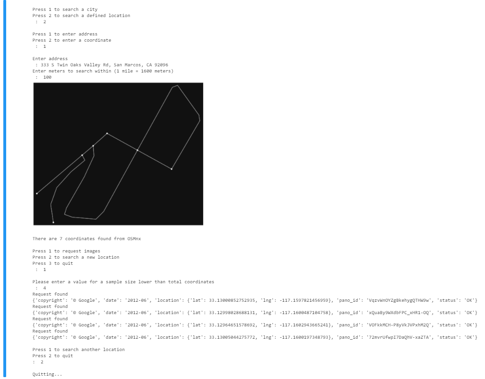

# Automated Image Retrieval Program
CSUSM Spring 2021

Instructor: Dr. Shaun-inn Wu

Client: Dr. Wesley Shultz

# Project Outline
Cougar Student Technologies was tasked with designing an software solution to retrieve multiple images of streets from Google Street View to be processed by a litter detection algorithm.  
# Dependencies
- Google Street View API key [Google Cloud Platform](https://cloud.google.com/)
- Python 3.6 or newer [Python Download](https://www.python.org/downloads/)
- Miniconda [Minidconda Download](https://docs.conda.io/en/latest/miniconda.html)
### OSMnx
Recommended by the previous team Stoic Solutions, we implemented an open source Python package called [OSMnx](https://geoffboeing.com/2016/11/osmnx-python-street-networks/) which allowed us to build street networks with many parameters. 

OSMnx detecting all the streets in San Marcos
# Implementation
Each white dot in the street network above is a node created to map out intersections. Each node consisted of metadata including its latitude and longtitude.

These coordinates were pulled and compiled into a list, which was implemented to request 4 images for each coordinate pair.

A Google Street View image request is an HTTP URL. The URL requires the location as parameters. Other parameters such as the image size and heading are used to produce 4 images. 

[Information on Google Street View API](https://developers.google.com/maps/documentation/streetview/overview)

The metadata is requested first before requesting the image, then both the metadata and image is saved into the defined directory path.

User prompts allow for multiple ways to create the street networks, including an entire city. Once the network and nodes have been created, the user is prompted to input a sample size, to randomly choose which coordinates are chosen. The request status is printed to see if there is a valid image available from Google Street View and the image and metadata is stored in the directory. 

*Note in the above example, any decision to use an address or coordinate must be accompanied by a distance value, to designate how far  to create the street network.
# Scripts
### [prototype_final.ipynb](scripts/prototype_final.ipynb)
This script implements both OSMnx and the Google Street View API to collect a list of latitude and longtitude coordinate pairs and use those pairs to request images from the Google Street View API.

### [prototype_OSMnx.ipynb](scripts/prototype_OSMnx.ipynb)
This script demonstrates how to use OSMnx within the context of this project. OSMnx can create a street network with a city, address, or coordinate pair. The street network generates nodes at each intersection which are accompanied by the latitude and longtitude of the node. We simply pull the lat and long of each node and create a list of coordinate pairs. 

### [prototype_1.py](scripts/prototype_1.py)
This script inputs an address or coordinate pair and requests the metadata and image from the Google Street View API. The image and metadata are stored in a defined directory path.

### [prototype_2.py](scritps/prototype_2.py)
Version 2 functions similarly to version 1 except the script will request an image 4 times. Each time the field of view is rotated 90 degrees to obtain a 360 view of a single location. 
