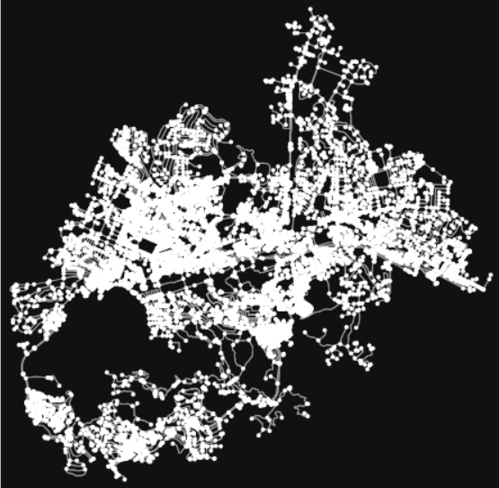

# Automated Image Retrieval Program
CSUSM Spring 2021

Instructor: Dr. Shaun-inn Wu

Client: Dr. Wesley Shultz

# Project Outline
Cougar Student Technologies was tasked with designing an software solution to retrieve multiple images of streets from Google Street View to be processed by a litter detection algorithm.  
# Dependencies
- Google Street View API key [Google Cloud Platform](https://cloud.google.com/)
- Python 3.6 or newer [Python Download](https://www.python.org/downloads/)
- Miniconda [Minidconda Download](https://docs.conda.io/en/latest/miniconda.html)
# Implementation
Recommended by the previous team Stoic Solutions, we implemented an open source Python package called [OSMnx](https://geoffboeing.com/2016/11/osmnx-python-street-networks/) which allowed us to build street networks with many parameters. 

OSMnx detecting all the streets in San Marcos
